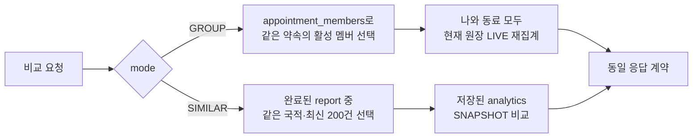

> **성과:** 동료 비교는 현재 원장을 같은 기준으로 다시 계산하고, 유사 사용자 비교는 완료된 리포트 스냅샷을 사용하도록 분리했습니다. 리뷰에서 발견한 참가자 누락에는 근사 경로를 추가했지만, 상위 데이터가 정비된 뒤 오염 위험이 더 커지자 다시 제거했습니다.

## 상황과 내 역할

여행 리포트에 “나와 같은 약속의 동료”(`GROUP`)와 “같은 국적의 여행자”(`SIMILAR`)를 비교하는 기능이 필요했습니다. 저는 비교 API, MyBatis 집계 쿼리, Vue 탭과 인사이트 UI를 구현하고 MySQL·브라우저 검증까지 담당했습니다. 리포트 생성, 약속·여정 도메인의 상위 연결 작업은 다른 팀원의 영역이었고 저는 공개된 계약을 소비했습니다.

## 문제와 제약

비교 대상만 고르는 문제가 아니었습니다. 내 리포트의 지출은 생성 시점의 스냅샷인데 동료 원장은 계속 바뀔 수 있고, 초기 데이터에서는 참가자의 `trip_id`가 비어 있어 정상 참가자가 비교군에서 누락됐습니다. 반대로 활동일이 겹친다는 이유만으로 약속을 추정하면 같은 기간의 다른 여행까지 섞일 수 있었습니다. QR 결제와 정산 지분을 함께 더하는 현재 원장 정의에도 중복 가능성이 있었습니다.

## 검토한 대안과 선택 기준

| 대안                           | 장점             | 제외하거나 제한한 이유                                                          |
| ------------------------------ | ---------------- | ------------------------------------------------------------------------------- |
| 모든 비교를 현재 원장에서 계산 | 최신 상태        | 과거 리포트와 비교 시점이 달라지고, 유사 사용자 200명의 원장을 반복 집계해야 함 |
| 모든 비교를 스냅샷으로 고정    | 재현 가능        | 같은 그룹 안에서도 생성 시점이 달라 공정한 현재 비교가 어려움                   |
| 활동일 중첩으로 참가 관계 추정 | 누락 데이터 보완 | 관계가 아닌 시간의 유사성이라 다른 여정을 포함할 수 있음                        |

선택 기준은 **같은 화면의 수치가 같은 시간 기준인가**, **비교군의 소속을 설명할 수 있는가**, **현재 데이터 모델에서 재현 가능한가**였습니다.

## 해결 방법

`GROUP`은 `appointment_members.trip_id`와 `trip_items.appointment_id`라는 명시적 관계만 따라가며, 요청 시점에 나와 동료를 모두 다시 계산합니다. `SIMILAR`은 집단 통계의 재현성과 비용을 위해 완료된 리포트의 `analytics` 스냅샷을 사용합니다.

첫 PR의 MySQL 검증에서는 호스트는 잡혔지만 참가자 비교가 비어 있다는 리뷰가 있었습니다. 당시 참가자의 연결 정보가 부족해 활동일 근사 경로를 추가했습니다. 이후 상위 가입 흐름에서 두 연결이 채워지자, 근사 경로는 도움이 아니라 “겹치는 별도 여정”을 섞는 위험이 됐습니다. 그래서 후속 PR에서 근사 로직과 테스트 fixture를 함께 제거하고 명시적 관계만 남겼습니다. UI에서는 비교 데이터가 없거나 로딩·오류 상태일 때 AI 인사이트를 숨기고, 실제 표시값을 먼저 반올림한 뒤 문장을 생성해 숫자 불일치를 막았습니다.

## 검증된 결과

- 최초 API는 로컬 MySQL 8.4에서 4단계 관계 조인과 JSON 집계를 포함한 통합 테스트 1건을 통과했습니다.
- 근사 경로 제거 후 호스트·참가자 포함, 취소 멤버 제외, 기간만 겹친 제3자 미포함, `SIMILAR` 경로를 scratch MySQL에서 재검증했습니다.
- 프런트엔드는 빈 비교군·오류·레이더 보정축·반올림·접근성 시나리오를 단위 테스트와 실제 브라우저 스냅샷으로 확인했습니다.

## 남은 한계와 회고

현재 `GROUP` 집계는 QR 결제 총액과 정산 지분을 함께 합산하므로 같은 소비의 중복 가능성이 있고 환불을 차감하지 않습니다. `SIMILAR`도 국적만 사용하며 최대 200개 최신 스냅샷이라는 제한이 있습니다. 이 사례에서 가장 중요한 결과는 처음의 우회책을 지킨 것이 아니라, **데이터 모델이 바뀌면 과거의 방어 로직도 다시 위험 모델링해야 한다**는 기준을 세운 것입니다.

## 근거

- 구현: [PR #400](https://github.com/T-ravelers/NA-WA/pull/400), [PR #405](https://github.com/T-ravelers/NA-WA/pull/405), [PR #416](https://github.com/T-ravelers/NA-WA/pull/416), [PR #445](https://github.com/T-ravelers/NA-WA/pull/445)
- 판단 변화: [참가자 누락 리뷰](https://github.com/T-ravelers/NA-WA/pull/400#issuecomment-5379746742), [근사 경로 도입 답변](https://github.com/T-ravelers/NA-WA/pull/400#issuecomment-5380383560), [근사 경로 제거 배경](https://github.com/T-ravelers/NA-WA/pull/416)
- 검증: [최초 MySQL 결과](https://github.com/T-ravelers/NA-WA/pull/400#issuecomment-5379431419), [SIMILAR 후속 리뷰 반영](https://github.com/T-ravelers/NA-WA/pull/445#issuecomment-5384384934)
- 최종 계약: [REPORT_API.md](https://github.com/T-ravelers/NA-WA/blob/2a1532601b1794e2e0cde561fc63e80a39911c6c/backend/docs/REPORT_API.md), [ReportService.java](https://github.com/T-ravelers/NA-WA/blob/2a1532601b1794e2e0cde561fc63e80a39911c6c/backend/src/main/java/me/nawa/report/service/ReportService.java), [ReportMapper.xml](https://github.com/T-ravelers/NA-WA/blob/2a1532601b1794e2e0cde561fc63e80a39911c6c/backend/src/main/resources/me/nawa/report/mapper/ReportMapper.xml)
