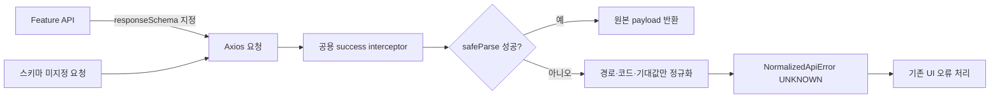

> **성과:** TypeScript 타입과 다른 백엔드 응답이 화면 깊숙이 전파되던 문제를, 기존 API 전체를 깨뜨리지 않는 요청별 Zod 검증과 feature 소유 스키마로 차단했습니다.

## 상황과 내 역할

백엔드의 nullable 배열 날짜가 프런트엔드 타입과 달라 런타임 오류로 이어진 사건 이후, API 경계에서 실제 응답을 확인할 필요가 생겼습니다. 저는 공용 Axios 계약을 확장하고 Explore·Wallet의 스키마와 테스트를 작성해 7개 읽기 요청에 첫 적용했습니다.

## 문제와 제약

TypeScript의 제네릭은 컴파일 후 사라지므로 `get<Foo>()`가 실제 JSON을 보장하지 않습니다. 그러나 모든 요청에 즉시 검증을 강제하면 수십 개 기존 API와 인증·CSRF·blob 오류 처리까지 한 번에 흔들립니다. 반대로 각 composable에서 수동 `safeParse`를 반복하면 오류 형식과 로깅이 갈라집니다. 공용 API 계층이 feature 스키마를 import하면 의존 방향도 뒤집힙니다.

## 검토한 대안과 선택 기준

| 대안                             | 판단                                                               |
| -------------------------------- | ------------------------------------------------------------------ |
| 전역 응답 스키마 강제            | 이상적 최종상은 될 수 있으나 마이그레이션 실패 반경이 너무 커 제외 |
| 각 호출부에서 직접 검증          | 빠르지만 중복·오류 형식 불일치 때문에 제외                         |
| 요청 config에 선택적 스키마 지정 | 기존 요청은 그대로 두고 위험한 경계부터 확장할 수 있어 선택        |

기준은 **점진 도입 가능성**, **기존 refresh/CSRF 흐름 보존**, **스키마의 도메인 소유권**, **운영 로그에 민감한 payload를 남기지 않는가**였습니다.

## 해결 방법

공용 Axios config에 선택적 `responseSchema`를 추가하고 success interceptor에서만 `safeParse`합니다. 성공해도 Zod의 변환 결과가 아닌 원본 payload를 반환해 숨은 정규화를 만들지 않았습니다. 실패 시 query와 hash를 제거한 URL, issue의 path·code·expected만 남기고 응답 본문은 오류 메시지에 넣지 않았습니다. 예외는 기존 `NormalizedApiError`로 합류하므로 호출부의 오류 처리를 재사용합니다.

스키마는 Explore와 Wallet feature가 각각 소유합니다. 상태·이벤트 종류처럼 모르는 값이 잘못된 동작을 만드는 필드는 enum으로 엄격히 막고, 향후 서버 값도 안전하게 표시 가능한 필드는 string과 UI fallback을 유지했습니다. Jackson이 반환할 수 있는 문자열/배열 날짜와 nullable 목록도 실제 계약에 맞게 모델링했습니다.

## 검증된 결과

Explore·Wallet 7개 읽기 요청에 적용하고, 집중 테스트 8개 파일 76건과 전체 단위 테스트 94개 파일 494건, 포맷·린트·타입 검사·빌드를 통과했습니다. 인증 401과 blob 오류 경로가 기존 순서를 유지하는 회귀 테스트도 포함했습니다. 당시 Zod 도입으로 생성된 스키마 청크는 65.17KB, gzip 17.51KB였고 PWA precache는 68.1KiB 증가했습니다. 실제 백엔드의 모든 Jackson 직렬화 조합을 브라우저에서 검증한 것은 아니므로 테스트 fixture 기반 증거와 구분했습니다.

## 남은 한계와 회고

선택적 검증은 미적용 요청을 보호하지 않습니다. 대신 검증 실패가 실제로 발견되는 feature부터 스키마를 확장하고, 계약이 안정된 뒤 공통 DTO 후보를 승격할 수 있습니다. 중요한 선택은 Zod 자체가 아니라 **전역 계층은 실행 메커니즘만 제공하고, 무엇이 유효한지는 도메인이 소유하게 한 것**입니다.

## 근거

- 배경과 구현: [Issue #160](https://github.com/T-ravelers/NA-WA/issues/160), [Issue #171](https://github.com/T-ravelers/NA-WA/issues/171), [PR #188](https://github.com/T-ravelers/NA-WA/pull/188)
- 핵심 코드: [responseSchema.ts](https://github.com/T-ravelers/NA-WA/blob/9ed7a70a3829fdb5fdc2e3e8373c32d740f249c8/frontend/src/shared/api/responseSchema.ts), [httpClient.ts](https://github.com/T-ravelers/NA-WA/blob/9ed7a70a3829fdb5fdc2e3e8373c32d740f249c8/frontend/src/shared/api/httpClient.ts)
- feature 소유권: [Explore schema](https://github.com/T-ravelers/NA-WA/blob/9ed7a70a3829fdb5fdc2e3e8373c32d740f249c8/frontend/src/features/explore/api/exploreResponseSchemas.ts), [Wallet schema](https://github.com/T-ravelers/NA-WA/blob/9ed7a70a3829fdb5fdc2e3e8373c32d740f249c8/frontend/src/features/wallet/api/walletResponseSchemas.ts)
