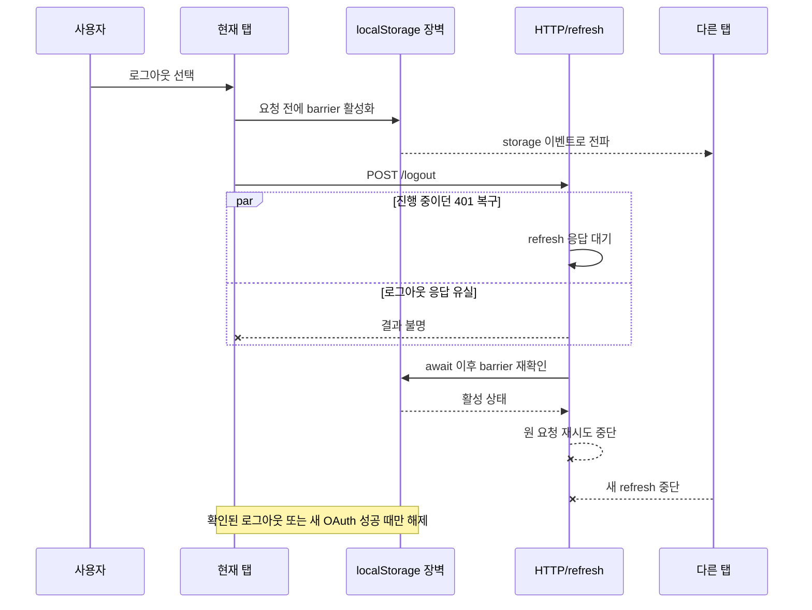

> **성과:** 로그아웃 요청이 전송된 뒤 응답을 받지 못한 상태를 성공이나 실패로 추측하지 않고, 브라우저가 새 인증을 확인할 때까지 refresh·원 요청 재시도를 차단하는 영속 장벽을 설계했습니다.

## 상황과 내 역할

NA-WA의 인증은 OAuth 로그인, HttpOnly refresh cookie, Redis 세션, Axios의 401 복구가 함께 동작합니다. 저는 소셜 로그인 기반, 로그아웃 계약, 비활성 회원 refresh 차단, 프런트엔드 로그아웃 장벽과 콜백 강화까지 단계적으로 구현했습니다. 이 사례는 그중 “로그아웃 직후 세션이 되살아나는가”라는 브라우저 경계에 집중합니다.

## 문제와 제약

로그아웃 중 네트워크가 끊기면 브라우저는 서버가 Redis 토큰을 폐기했는지 알 수 없습니다. 이를 단순 실패로 처리해 로그인 가드나 401 인터셉터가 refresh를 보내면, 서버에서 로그아웃이 처리되지 않은 경우 세션이 다시 복구됩니다. 메모리 플래그만 쓰면 새로고침에서 사라지고, 한 탭만 막으면 다른 탭이 refresh를 시작할 수 있습니다. 이미 진행 중인 refresh가 장벽보다 먼저 시작됐지만 더 늦게 완료되는 경쟁 조건도 있었습니다.

## 검토한 대안과 선택 기준

- 응답 오류 시 장벽 해제: 사용성은 빠르지만 “서버 상태를 모른다”는 핵심 사실을 숨기므로 제외했습니다.
- 메모리 상태 또는 현재 탭만 차단: reload·다중 탭에서 보호가 끊겨 제외했습니다.
- 일정 시간 후 자동 해제: 오래 막히는 문제는 줄지만 안전한 만료 시간을 증명할 수 없어 제외했습니다.
- 새 OAuth 성공 전까지 영속 차단: 보수적이지만 상태를 추측하지 않으며 사용자가 명시적으로 다시 인증하면 복구할 수 있어 선택했습니다.

## 해결 방법

`localStorage`에 장벽을 쓰고 같은 탭에는 커스텀 이벤트, 다른 탭에는 `storage` 이벤트로 즉시 전파했습니다. 장벽은 로그아웃 요청 **전에** 켜며, 확인된 로그아웃 또는 새 로그인 성공에서만 지웁니다. 세션 복구는 refresh 시작 전뿐 아니라 `await refreshOnce()` 직후에도 장벽을 다시 확인합니다. 이 두 번째 검사가 리뷰에서 발견된 경쟁 조건—이미 시작된 refresh가 뒤늦게 성공해 원 요청을 재시도하는 경우—를 닫았습니다. 동시에 `refreshOnce` 단일 실행을 유지해 여러 401이 refresh 폭주를 만들지 않도록 했습니다.

## 검증된 결과

장벽 구현 PR에서 포맷·린트·타입 검사·빌드와 단위 테스트 68개 파일 359건을 통과했고, Chromium E2E로 정상 로그아웃, 응답 유실, reload·다중 탭 흐름 3건을 확인했습니다. 지연 가능한 refresh promise를 사용한 회귀 테스트로 “refresh가 먼저 시작되고 로그아웃 장벽이 나중에 켜진” 순서도 고정했습니다. E2E의 API는 스텁이므로 실제 Redis 장애나 Firefox·WebKit까지 증명한 결과로 표현하지 않았습니다.

## 남은 한계와 회고

fail-closed 선택은 응답이 유실된 사용자를 다시 로그인하게 만들 수 있습니다. 대신 보안 경계에서 서버 상태를 추측해 자동 복구하는 것보다 명시적 재인증을 요구하는 편이 설명 가능했습니다. 또한 서버의 회원 활성 상태 검사와 클라이언트 장벽은 대체 관계가 아닙니다. 전자는 refresh 발급 조건을, 후자는 브라우저가 불확실한 상태에서 요청을 재개하지 않는 조건을 담당합니다.

## 근거

- 구현 흐름: [PR #41](https://github.com/T-ravelers/NA-WA/pull/41), [PR #131](https://github.com/T-ravelers/NA-WA/pull/131), [PR #142](https://github.com/T-ravelers/NA-WA/pull/142), [PR #167](https://github.com/T-ravelers/NA-WA/pull/167), [PR #220](https://github.com/T-ravelers/NA-WA/pull/220), [Issue #134](https://github.com/T-ravelers/NA-WA/issues/134)
- 경쟁 조건: [리뷰 지적](https://github.com/T-ravelers/NA-WA/pull/167#discussion_r3762914057), [수정 답변](https://github.com/T-ravelers/NA-WA/pull/167#discussion_r3763064755), [Changes requested](https://github.com/T-ravelers/NA-WA/pull/167#pullrequestreview-4912142693)
- 최종 코드: [signOutBarrier.ts](https://github.com/T-ravelers/NA-WA/blob/43e7ddcdb6ff2de25bf820dd7196acd953f916f7/frontend/src/shared/api/signOutBarrier.ts), [sessionRecovery.ts](https://github.com/T-ravelers/NA-WA/blob/43e7ddcdb6ff2de25bf820dd7196acd953f916f7/frontend/src/shared/api/sessionRecovery.ts), [httpClient.spec.ts](https://github.com/T-ravelers/NA-WA/blob/43e7ddcdb6ff2de25bf820dd7196acd953f916f7/frontend/src/shared/api/__tests__/httpClient.spec.ts)
